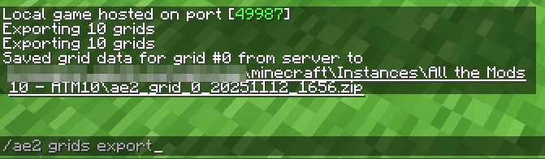
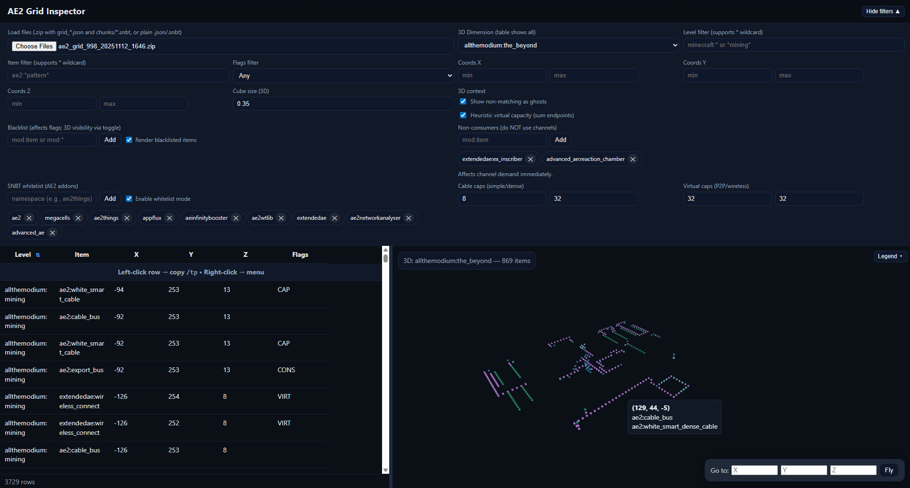
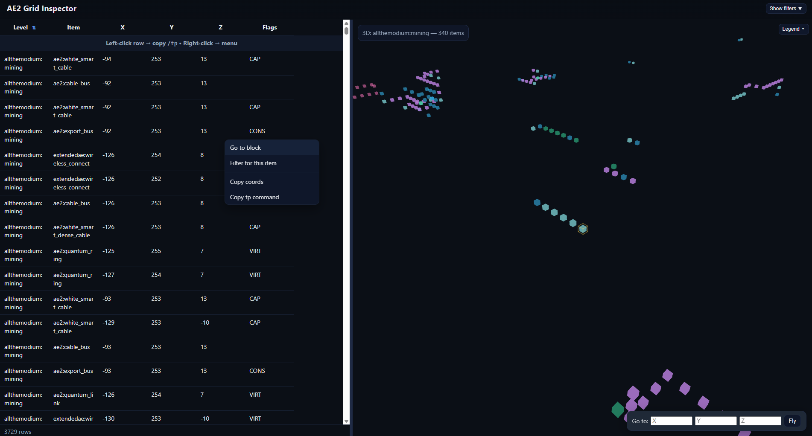

# 🧩 AE2 Grid Inspector

**Interactive visualizer and analyzer for Applied Energistics 2 (AE2) networks**

> Inspect, filter, and visualize AE2 networks from Minecraft world dumps (`grid_*.json` and `chunks/*.snbt`) — directly
> in your browser, with 3D rendering powered by Three.js.

---

## 🧠 Overview

AE2 Grid Inspector is a standalone HTML + JavaScript tool designed to explore the **internal AE2 channel network**
structure in complex modded Minecraft worlds (ATM10, Create Above and Beyond, etc.).  
It helps modpack players and developers **diagnose channel starvation, cable overload, and network segmentation**
visually.

You can **drop a `.zip` file** containing your `grid_*.json` dump (from `/ae2 grids export`)
and `chunks/*.snbt` files — and get:

- 📋 A sortable and filterable table of all AE2 devices
- 🌌 A 3D visualization of the network layout
- 🔍 Tools to detect *starved islands*, *suspect cables*, *capacity providers*, *virtual links*, and *channel consumers*
- ⚙️ Full filtering system for levels, dimensions, items, coordinates, and flags
- 🧱 Configurable blacklist, whitelist, and non-consumer items
- 🖱️ Context menu to teleport or filter directly to a specific block
- 🎨 Interactive 3D camera and dynamic legend
- 🔄 Live re-rendering as you tweak filters

---

## 🚀 Features

| Category                          | Description                                                                                   |
|-----------------------------------|-----------------------------------------------------------------------------------------------|
| **File Handling**                 | Supports `.zip` bundles with `grid_*.json` + `chunks/*.snbt`, or standalone `.json` / `.snbt` |
| **3D Visualization**              | Renders network cubes in 3D space using Three.js (colored by function)                        |
| **Automatic Dimension Detection** | Normalizes dimension names (e.g., `allthemodium_mining` → `allthemodium:mining`)              |
| **Smart Filtering**               | Filter by dimension, item ID, coordinates, or flag type (SUS, CAP, VIRT, CONS, STARVED, etc.) |
| **Blacklists & Whitelists**       | Exclude or restrict items/mods dynamically; supports wildcards like `mod:*`                   |
| **Non-Consumer Registry**         | Define blocks that don’t consume AE2 channels                                                 |
| **Live Updates**                  | Every filter change instantly updates both table and 3D view                                  |
| **Resizable Layout**              | Drag the center divider to resize table and 3D view                                           |
| **Context Menu**                  | Right-click rows to teleport, filter, or copy coordinates                                     |
| **Highlighting**                  | Yellow pulsing cube highlights selected coordinates                                           |
| **Legend Overlay**                | Toggleable legend explaining all colors and flags                                             |

---

## 🎨 3D Legend

| Color        | Flag                        | Meaning                                          |
|--------------|-----------------------------|--------------------------------------------------|
| 🟣 `#a78bfa` | **AE2 Cable Bus**           | Core node transmitting channels                  |
| 💖 `#f472b6` | **CAP (Capacity Provider)** | Dense/smart cables increasing available channels |
| 💙 `#38bdf8` | **VIRT (Virtual Link)**     | P2P tunnels, wireless or quantum bridges         |
| 💚 `#34d399` | **CONS (Consumer)**         | Blocks that consume at least one channel         |
| 🟡 `#ffb74d` | **STARVED (Island)**        | Subnetwork whose demand > capacity               |
| 🔴 `#f87171` | **SUS (Suspicious Cable)**  | Overloaded or near-capacity cable                |
| 🟨 `#ffd54f` | **Highlight**               | Last “Go to” or clicked coordinate (~20 s)       |

---

## 💾 How to Use

### 1. Obtain AE2 Data

You need to run a command. Meaning you should activate cheats for that (Open to LAN → with cheats).

```bash
/ae2 grids export
```

A zip file will be created


### 2. Open the Inspector

Either online over [https://ae2.gunther.icu](https://ae2.gunther.icu)

Or locally by cloning this repo and running `npx serve .`.

Choose your file or drag and drop the zip file to the upload button.


The table and 3D view will populate automatically.




### 3. Interact with the Data

- 🔍 Use filters at the top to narrow results (supports * wildcards).
- 🖱️ Right-click a row → context menu for Go to block, Filter for this item, or Copy coords.
- 📏 Adjust cube size and capacities as needed.
- 🎛️ Collapse/expand the filter panel using the Hide filters button.
- 🧹 Click Clear to unload data (enables new drag & drop).
- 🔄 Click Reset to restore default settings without unloading.

## Non-Consumer

You can define items that **don’t** consume channels.

Default list:

```json
[
  "extendedae:ex_inscriber",
  "advanced_ae:reaction_chamber"
]
```

## Whitelist

Restrict SNBT parsing to specific namespaces:

```json
[
  "ae2",
  "megacells",
  "ae2things",
  "appflux",
  "aeinfinitybooster",
  "ae2wtlib",
  "extendedae",
  "ae2networkanalyser",
  "advanced_ae"
]
```

## 🧩 Dependencies

- [Three.js](https://threejs.org/) — 3D rendering
- [JSZip](https://stuk.github.io/jszip/) — Zip decompression
- Vanilla HTML5, CSS, and JavaScript (no frameworks)
- Tested with Chrome 120+, Firefox 120+, and Edge 120+

## 🧱 Development Notes

- Fully self-contained — no external build pipeline
- Written in modern ES modules
- Persistent user preferences in localStorage
- Modular functions for parsing JSON and SNBT dumps
- Supports live re-computation without reloads
- Auto-resizable 3D view with splitter persistence

## 🛠️ Troubleshooting

| Symptom           | Cause / Fix                                                                     |
|-------------------|---------------------------------------------------------------------------------|
| **Nothing loads** | Ensure the file is a `.zip` containing valid `grid_*.json` and `chunks/*.snbt`. |
| **3D view blank** | Verify `Heuristic virtual capacity` checkbox or try `Reset`.                    |

## 🤝 Contribution

This was a fun side project built to make debugging my AE2 network a bit less painful.  
It **mostly works well**, but there may still be edge cases or rendering quirks depending on how AE2 or its addons
encode data.

Contributions are **very welcome** — whether it’s fixing a bug, improving performance, adding mod support, or enhancing
the UI/UX.

You can contribute by:

1. **Opening an Issue** — report bugs, false positives, missing block detections, or suggest improvements.
2. **Submitting a Pull Request (PR)** — for code fixes, feature additions, or documentation updates.

Even small improvements (like clarifying a legend entry or optimizing the 3D view) help make the tool better for
everyone.

If you fork and make changes, please try to:

- Keep the project single-file (or max 3 files: index.html, scripts.js, styles.css) and self-contained.
- Follow the existing code style (early returns, clear naming, no deep nesting).
- Test against real AE2 dumps when possible.

---

_“This project started as a personal diagnostic utility, but it’s turning into a community tool — and that’s awesome.”_

