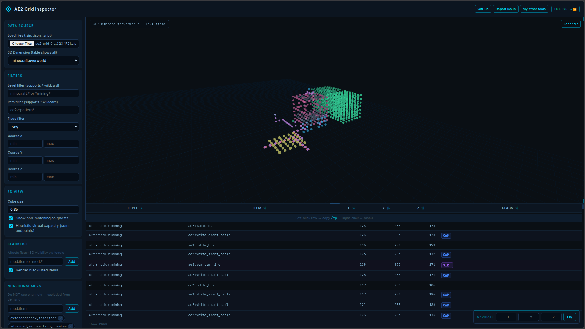
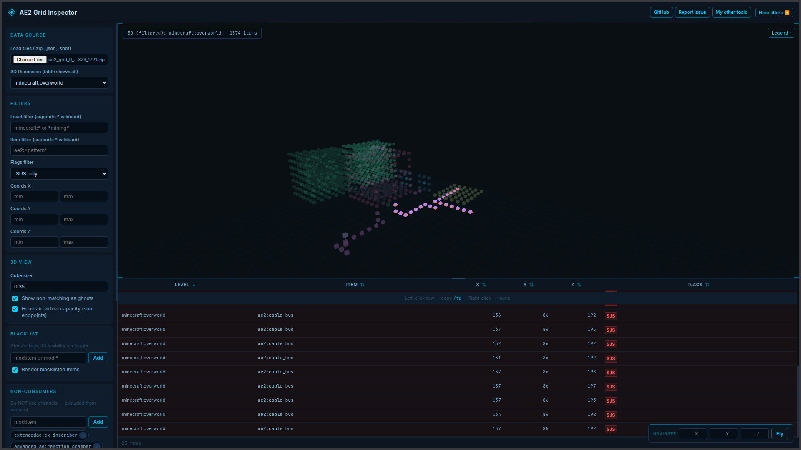
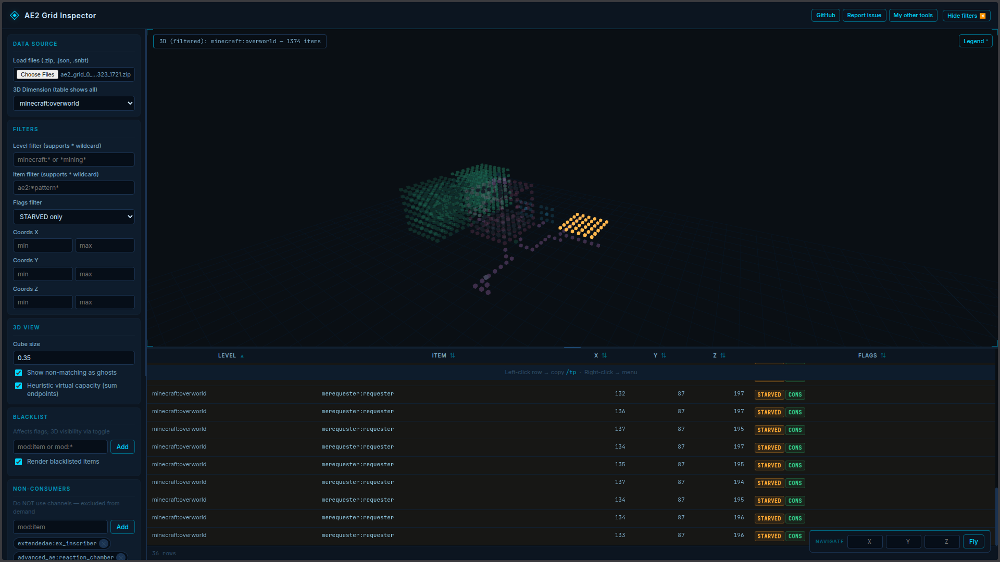

# AE2 Grid Inspector

A browser-based visualizer for Applied Energistics 2 networks. Load your grid export and instantly see every cable,
device, and channel consumer mapped in an interactive 3D scene, with a filterable data table and automatic detection of
overloaded or starved network segments.

No server required — open `index.html` directly in your browser or serve it with any static file server.

**Live version: [ae2.jubnl.ch](https://ae2.jubnl.ch)**

---

## Screenshots

### In-game — the networks being inspected

|                      Starved requesters                       |                      Quantum computer and matrix                       |                      Controller + matrix                       |
|:-------------------------------------------------------------:|:----------------------------------------------------------------------:|:--------------------------------------------------------------:|
|  |  |  |

### Web UI — AE2 Grid Inspector

**3D network overview**


**SUS filter — cable-sus segments**


**STARVED filter — channel-starved segments**


---

## Getting the export from Minecraft

Run the following command in-game (requires AE2 Network Analyser or similar):

```
/ae2 grids export
```

This produces a `.zip` file (or a folder with `grid_*.json` and `chunks/*.snbt` files) in your instance's root
directory. Drop the zip directly onto the file picker in the inspector.

---

## Usage

1. Open `index.html` in a browser (Chrome / Firefox / Edge — any browser with ES module support).
2. Click **Load files** and select the `.zip` produced by `/ae2 grids export`, or select individual `grid_*.json` and
   `chunks/*.snbt` files.
3. Use the **dimension selector** to switch between overworld / nether / modded dimensions.
4. Use the **filter panel** to narrow down by level, item ID, coordinates, or flag.
5. Click any table row to copy a `/tp` command for that block to your clipboard.
6. Right-click a row or a 3D cube for more actions (go to location, filter by item, copy coords).

---

## 3D view

Each dot represents one AE2 block or cable-bus part at its exact world coordinates. Colours indicate role:

| Colour   | Meaning                                                                       |
|----------|-------------------------------------------------------------------------------|
| Violet   | Cable bus (`ae2:cable_bus`)                                                   |
| Pink     | Channel capacity provider (cables, controller) — **CAP**                      |
| Cyan     | Virtual channel link (P2P, wireless, quantum link) — **VIRT**                 |
| Green    | Channel consumer (storage bus, interface, requester, assembler, …) — **CONS** |
| Orange   | Consumer on a starved island — **STARVED**                                    |
| Slate    | Other AE2 device (energy cell, structural multiblock block, …)                |
| Red ring | Cable bus with more consumers than channel capacity — **SUS**                 |

Rotating/zooming is handled by OrbitControls. The camera auto-fits to the visible data when you load a file or change
the dimension.

---

## Flag reference

| Flag        | Trigger                                                                         |
|-------------|---------------------------------------------------------------------------------|
| **SUS**     | A cable bus whose reachable consumer chain exceeds the cable's channel capacity |
| **STARVED** | A consumer on a network island whose total demand exceeds available capacity    |
| **CAP**     | A block that provides channel capacity (cable, dense cable, controller)         |
| **VIRT**    | A virtual-channel link (P2P tunnel, wireless AP, quantum link/ring/bridge)      |
| **CONS**    | A device that consumes a channel                                                |

### Channel capacity defaults (configurable in the UI)

| Cable type                    | Default channels |
|-------------------------------|------------------|
| Smart / covered / glass cable | 8                |
| Dense cable                   | 32               |
| P2P tunnel                    | 32               |
| Wireless / quantum link       | 32               |

---

## Multiblock structures

The following multiblock structures count as **one channel consumer** regardless of how many blocks they contain. All
their component blocks are still shown individually in the table and the 3D view.

- **Extended AE assembler matrix** (`extendedae:assembler_matrix_*`) — the entire assembled matrix uses 1 channel
- **Advanced AE quantum computer** (`advanced_ae:quantum_*`) — the entire quantum computer multiblock uses 1 channel

---

## Supported mods

Classification is **namespace-agnostic** — the name portion of each item ID is matched, not the mod prefix. Out of the
box the tool correctly handles:

- Applied Energistics 2 (`ae2`)
- Extended AE (`extendedae`)
- Advanced AE (`advanced_ae`)
- Mega Cells (`megacells`)
- AE2 Things (`ae2things`)
- AE2 WTLib (`ae2wtlib`)
- ME Requester (`merequester`)
- AppFlux (`appflux`)
- AE2 Infinity Booster (`aeinfinitybooster`)
- AE2 Network Analyser (`ae2networkanalyser`)

Any other mod that follows AE2 naming conventions (e.g. `_cable`, `_bus`, `_interface`, `_requester`) is picked up
automatically.

---

## Filters

| Filter        | Description                                                   |
|---------------|---------------------------------------------------------------|
| Level         | Wildcard match on dimension ID (e.g. `*overworld*`)           |
| Item          | Wildcard match on item ID (e.g. `*storage_bus*`)              |
| X / Y / Z     | Min/max coordinate range                                      |
| Flags         | Show only items with a specific flag                          |
| Blacklist     | Hide specific items or entire namespaces (`mod:*`)            |
| Non-consumers | Declare items that look like consumers but don't use channels |
| Whitelist     | Restrict the table and 3D view to specific namespaces         |

---

## Configuration panel

| Setting                | Default | Effect                                                           |
|------------------------|---------|------------------------------------------------------------------|
| Cube size              | 0.35    | Visual size of each dot in the 3D view                           |
| Show context (ghost)   | on      | Render non-matching items at low opacity when a filter is active |
| Virtual link heuristic | on      | Add virtual-link channel capacity to the island budget           |
| Simple cable channels  | 8       | Threshold for smart/covered/glass cables                         |
| Dense cable channels   | 32      | Threshold for dense cables                                       |
| P2P channels           | 32      | Virtual channels per P2P tunnel                                  |
| Wireless channels      | 32      | Virtual channels per wireless / quantum link                     |

All thresholds are read at computation time — changing them instantly recalculates all flags without reloading the file.

---

## Debug mode

Append `?debug=1` to the URL before loading a file to enable console output:

- `console.table()` of the first 20 parsed records with all extracted fields
- Flag count summary (SUS / STARVED / CAP / VIRT / CONS / unflagged)
- List of distinct dimension levels found in the export
- Count of SNBT-only records (blocks present in chunk data but not in any grid JSON)

---

## Running locally

```bash
# any static file server works
python3 -m http.server 8000
# then open http://localhost:8000
```

No build step. No npm. Three.js is loaded from CDN.

---

## Notes

- The AE2 grid export does **not** include live channel usage counters. All flag logic is heuristic, derived from cable
  type, device type, and physical adjacency.
- Consumer chains are traversed by BFS: a device adjacent to another consumer (but not directly adjacent to a cable bus)
  still counts as a channel consumer on that cable bus.
- Multiple grid files (multiple sub-networks) are all loaded and merged. Use the dimension selector to navigate between
  them.
